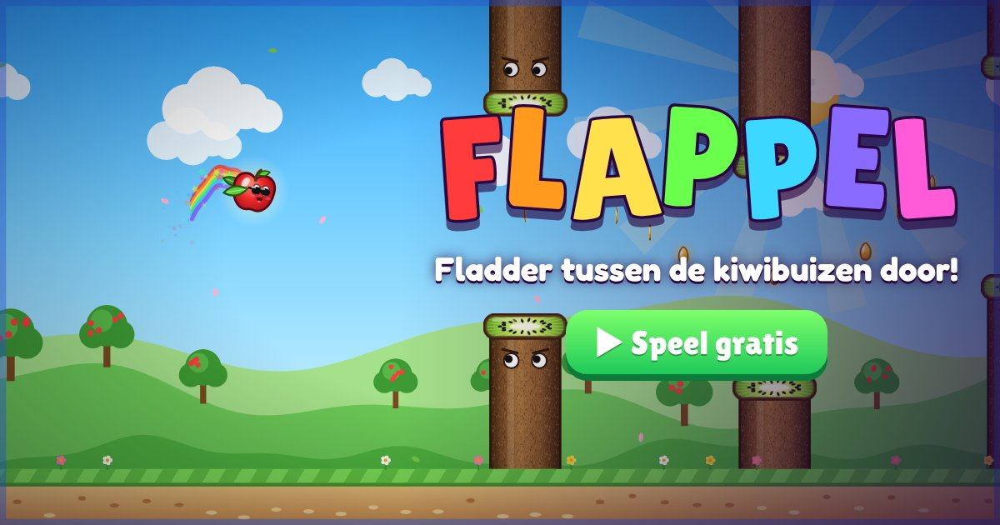

# 🍎 Flappel + 🎮 keuzescherm

Twee losse onderdelen voor **stijnbarendse.nl**:

| Map | Wat | Online adres |
| --- | --- | --- |
| [`flappel/`](flappel/) | **Flappel**: Flappy Bird, maar dan een appel die tussen **kiwibuizen** door fladdert | `stijnbarendse.nl/flappel` |
| [`game/`](game/) | **Keuzescherm**: kies tussen Andy Apples en Flappel | `stijnbarendse.nl/game` |

Alles (graphics, muziek en geluid) wordt in code gemaakt. Geen build-stap, geen npm, geen installatie.

## Op de site zetten

Beide mappen staan helemaal op zichzelf en gebruiken alleen relatieve paden. Kopieer ze zo naar de site:

```
stijnbarendse.nl/
├── appel/      ← Andy Apples (bestaat al)
├── flappel/    ← kopie van de map flappel/
└── game/       ← kopie van de map game/
```

- Het keuzescherm linkt nar `../appel` en `../flappel`, en Flappel linkt met **🎮 Alle games** terug naar `../game` (`hubUrl` in `flappel/js/config.js`).
- Werkt ook als het adres zonder `/` aan het eind wordt geopend (`stijnbarendse.nl/flappel`): een klein scriptje bovenin de pagina zet dan de basis van de paden goed.
- Lokaal proberen: open `index.html` in deze map (stuurt door naar het keuzescherm), of `flappel/index.html` direct.
- Link-previews (WhatsApp, Discord): `flappel/og-flappel.jpg` en `game/img/og-game.jpg`. De `og:`-tags gebruiken absolute adressen op `https://stijnbarendse.nl/…`; pas die aan als de games ergens anders komen te staan.

## Flappel

Tik, klik of druk op spatie om te fladderen. Vlieg tussen de kiwibuizen door, pak de gouden **pitten** en koop er upgrades en skins mee.

- **Makkelijk**: grote gaten, een zachte zwaartekracht, een botsingsrand die kleiner is dan de appel (schampen mag), het plafond is geen game over, en het tempo en de gaten worden maar langzaam (en tot een grens) lastiger. Na 12 buizen bewegen sommige buizen rustig op en neer.
- **11 stijlen** die tijdens het spelen wisselen (elke 8 buizen), met een regenboog-portaal vanuit de appel, een banner en eigen muziek: 🌳 Zonnige Boomgaard, 🌅 Zonsondergang, 🐠 Onderwaterwereld, 🌆 Synthwave, 🍭 Snoepland, 🚀 De Ruimte, 👾 Pixelwereld (echt in lage resolutie getekend), ❄️ Winterwonderland (met noorderlicht), 🌋 Vulkaaneiland, ✏️ Tekenland (bibberende potloodlijnen) en 🪩 Disco Inferno. De kiwibuizen veranderen mee (neon, getekend, bevroren, met glazuur…). Elk potje begint in een andere stijl.
- **Power-ups** (in bellen): ⭐ Superster (onkwetsbaar, kiwi's kapotrammen), 🚀 Raket (volle vaart, vanzelf door de gaten), 🧲 Magneet, ×2 Dubbel, 🐌 Slowmo en 🍒 Mini-appel.
- **Punten**: 1 per buis, **PERFECT** (+1) als je precies door het midden gaat, met combo's. Elke 25 buizen vuurwerk.
- **Upgrades**: ↕️ Brede buizen, 🛡️ Kiwischild, 🪶 Zweefblaadjes, ❤️ Tweede kans, 🧲 Pittenmagneet, 💰 Pittenoogst, 🍀 Klavertje vier, ⏳ Power-boost en 🚀 Raketstart.
- **Skins**: Rode Appel, Granny Smith, Pink Lady, Toffee-appel, Gouden Appel, IJsappel, Regenboog, Galaxy-appel en Diamant, elk met een eigen spoortje.
- **Muziek en geluid** worden gemaakt met WebAudio; de beelden bewegen mee op de maat. Knoppen voor geluid, muziek en **rustige effecten** (minder flitsen en schudden) staan rechtsboven in het menu.

| Toets | Wat |
| --- | --- |
| `Spatie`, `↑`, `W`, `Enter`, tikken of klikken | fladderen (en in het menu: spelen) |
| `P` of `Esc` | pauze |

### Bestanden

| Bestand | Wat |
| --- | --- |
| `js/config.js` | Supabase, de opslagsleutel van de inlogsessie, het adres van de site en van het keuzescherm |
| `js/data.js` | balans (zwaartekracht, snelheid, gaten), stijlen, power-ups, upgrades, skins en de save: **hier begin je bij balanceren** |
| `js/audio.js` | geluidseffecten en de muziek-sequencer (per stijl een liedje) |
| `js/render-bg.js` | achtergrond en grond van elke stijl |
| `js/render-world.js` | kiwibuizen, de appel, pitten, power-ups en deeltjes |
| `js/game.js` | spelverloop: fladderen, buizen maken, botsingen, punten, stijlwissels |
| `js/render.js` | scherm, stijlwissel en pixelstijl, HUD |
| `js/online.js` | account, online voortgang en ranglijst |
| `js/ui.js`, `js/main.js` | menu's, winkel en skins; invoer, hoofdlus en opstarten |

Testen: `node tools/smoke.mjs` (Node 18+ en Playwright: `npm i -g playwright`). Klikt het keuzescherm en Flappel helemaal door (alle stijlen, power-ups, winkel, skins, en inloggen en de ranglijst met een nep-Supabase), faalt bij elke JavaScript-fout, en laat een computerspeler met een trage reactie twaalf potjes spelen om te controleren dat het spel makkelijk blijft.

## Eén account met Andy Apples

Flappel gebruikt **hetzelfde Supabase-project** als [Andy Apples](https://github.com/Stoin3/andy-apple):

- **Zelfde inlogsessie**: de sessie staat in `localStorage['andyApples.auth']`, net als bij Andy Apples. Omdat beide games op `stijnbarendse.nl` staan, ben je na inloggen in de ene game meteen ook ingelogd in de andere (en uitloggen geldt ook voor beide).
- **Zelfde gebruikersnaam** (tabel `profiles`). Je kunt hem in beide games aanpassen.
- **Eigen voortgang**: Flappel bewaart zijn save in de *user metadata* van het account (`user_metadata.flappel`). Daar is geen extra tabel voor nodig, en de save van Andy Apples (tabel `saves`) wordt nooit aangeraakt. Heb je op twee apparaten gespeeld, dan worden de saves samengevoegd: van alles het beste (record, upgrades, skins, pitten).
- **Eigen ranglijst** voor Flappel: die heeft wél een tabel nodig, zie hieronder. Zolang die er niet is, zegt de ranglijst dat hij nog moet worden ingericht; de rest werkt gewoon.

### Supabase instellen (eenmalig, voor de ranglijst)

Open in het Supabase-project van Andy Apples **SQL Editor → New query**, plak dit en klik op **Run**:

```sql
-- ===== Ranglijst van Flappel: alleen spelers met een account en een gebruikersnaam (tabel profiles van Andy Apples) =====
create table public.flappel_ranking (
  user_id    uuid primary key references auth.users (id) on delete cascade,
  score      integer not null check (score between 0 and 100000),
  updated_at timestamptz not null default now()
);
alter table public.flappel_ranking enable row level security;  -- geen policies: schrijven kan alleen via flappel_submit

create or replace function public.flappel_submit(p_score integer)
returns void language plpgsql security definer set search_path = public as $$
begin
  if auth.uid() is null then raise exception 'niet ingelogd'; end if;
  if p_score is null or p_score < 0 or p_score > 100000 then raise exception 'ongeldige score'; end if;
  insert into public.flappel_ranking (user_id, score) values (auth.uid(), p_score)
  on conflict (user_id) do update
    set score = greatest(flappel_ranking.score, excluded.score),
        updated_at = case when excluded.score > flappel_ranking.score then now() else flappel_ranking.updated_at end;
end $$;
revoke all on function public.flappel_submit(integer) from public, anon;
grant execute on function public.flappel_submit(integer) to authenticated;

-- openbare lijst: alleen naam en score (de view leest de tabellen als eigenaar, dus e-mail en id blijven verborgen)
create or replace view public.flappel_leaderboard as
  select p.username as name, r.score, r.updated_at from public.flappel_ranking r join public.profiles p using (user_id);
revoke all on public.flappel_leaderboard from anon, authenticated;
grant select on public.flappel_leaderboard to anon, authenticated;
```

Voor de bevestigingsmail bij een nieuw account vanuit Flappel: zet `https://stijnbarendse.nl/flappel` erbij onder **Authentication → URL Configuration → Redirect URLs**. Staat hij er niet bij, dan stuurt de mail je naar de Site URL (Andy Apples); dat is ook goed, want daarna ben je in beide games ingelogd.

## Keuzescherm

`game/index.html` is één bestand met de plaatjes in `game/img/`. Twee grote kaarten (Andy Apples en Flappel) met wisselende spelbeelden, 3D-kanteling, een glans en een flits bij het kiezen, op een achtergrond met zwevend fruit. Ben je al ingelogd of heb je al een record, dan staat dat erbij (gelezen uit dezelfde opslag als de games). Toetsen `1` en `2` kiezen ook. De beelden van Andy Apples komen uit `art/` van de Andy Apples-repo.

## Licentie

De Andy Apples-beelden in `game/img/andy-*.jpg` vallen onder de licentie van [Andy Apples](https://github.com/Stoin3/andy-apple) (CC BY-NC 4.0).
